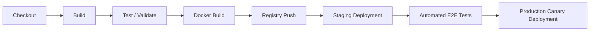

# Agile Sprint Assignment Report: Continuous Integration using Jenkins & Docker

**Topic:** General Purpose Web Chatbot Application (`OmniBot`)  
**Sprint Focus:** Continuous Integration (CI), GitHub Integration, Automated Testing, and Docker Containerization  
**Tooling:** Jenkins, Docker, GitHub, Node.js/Express  

---

## Executive Summary

In this Sprint, our team focused on establishing a robust **Continuous Integration (CI)** pipeline using **Jenkins** and **Docker** for a versatile **General Purpose Chatbot Application (`OmniBot`)**.

The primary objective was to automate the integration workflow—ensuring that every code check-in to GitHub automatically undergoes source code retrieval, build verification, automated unit testing, and Docker container image building. This report documents the complete architectural setup, Jenkinsfile creation, GitHub integration, initial build execution (Build #1), a live feature iteration push (Build #2), and a comparative analysis between manual software engineering processes and automated Jenkins CI.

---

## 1. General Chatbot Application Architecture

The application (`OmniBot`) is a full-stack Node.js/Express web application providing conversational artificial intelligence, math evaluation, time/date queries, tech FAQs, and custom general intent resolution.

### 1.1 Core Components
* **`src/chatbot.js`**: Core NLP/Intent engine matching incoming user queries against predefined intent patterns (Greetings, Time/Date, Math Calculations, Technology FAQs, System Capabilities, Health/Status).
* **`src/server.js`**: Express server exposing REST API endpoints (`/api/chat` and `/api/health`) and serving the responsive web UI.
* **`public/`**: Web interface built with modern UI design (dark glassmorphism, responsive chat bubbles, quick action chips, status indicators).
* **`test/chatbot.test.js`**: Automated unit test suite verifying intent resolution, edge cases, and health checks.
* **`Dockerfile`**: Multi-stage Docker definition ensuring container reproducibility and minimal production footprint.

### 1.2 Technology Stack
* **Language/Runtime:** Node.js (v22.x)
* **Framework:** Express.js (v4.21.x)
* **Testing:** Node.js Built-in Test Runner (`node --test`)
* **Containerization:** Docker (Alpine Linux base)
* **CI Orchestration:** Jenkins (Declarative Pipeline)

---

## 2. Jenkins Setup & GitHub Integration

### 2.1 Jenkins Server Configuration
1. **Jenkins Installation:** Jenkins was deployed using the official Jenkins LTS Docker container with Docker-in-Docker support (`jenkins/jenkins:lts`).
2. **Plugin Installation:** Required plugins installed:
   * *Git Plugin* & *GitHub Plugin* (for SCM checkout and webhook triggers)
   * *Pipeline Plugin* (for Declarative Jenkinsfile execution)
   * *Docker Pipeline Plugin* (for container build execution)
3. **Credentials Setup:** GitHub Personal Access Token (PAT) configured in Jenkins under `Manage Jenkins -> Credentials -> System -> Global credentials`.

### 2.2 GitHub Repository Connection & Webhook Setup
1. **Repository Creation & Local Commit:** Repository initialized and pushed to GitHub remote `origin`.
2. **Webhook Configuration:** 
   * Payload URL: `http://<JENKINS_HOST>:8080/github-webhook/`
   * Content type: `application/json`
   * Trigger events: `Just the push event`
3. **Pipeline Job Creation in Jenkins:**
   * Job Type: **Pipeline**
   * Definition: **Pipeline script from SCM**
   * SCM: **Git**
   * Repository URL: `https://github.com/imyashwanthsdp/LunarApi-Framework.git`
   * Branch Specifier: `*/main`
   * Script Path: `Jenkinsfile`

---

## 3. Jenkinsfile Pipeline Implementation

The pipeline is defined in a root-level `Jenkinsfile` using Jenkins Declarative syntax. It enforces five mandatory stages:

```groovy
pipeline {
    agent any

    environment {
        APP_NAME = 'general-chatbot'
        BUILD_TAG = "build-${BUILD_NUMBER}"
        IMAGE_NAME = "general-chatbot-app"
    }

    options {
        timeout(time: 15, unit: 'MINUTES')
        disableConcurrentBuilds()
        buildDiscarder(logRotator(numToKeepStr: '10'))
    }

    stages {
        stage('Checkout') {
            steps {
                echo "=========================================="
                echo "STAGE 1: CHECKOUT SOURCE CODE FROM GITHUB"
                echo "=========================================="
                checkout scm
                script {
                    def commitHash = sh(script: "git rev-parse --short HEAD || echo 'local-dev'", returnStdout: true).trim()
                    def commitBranch = sh(script: "git rev-parse --abbrev-ref HEAD || echo 'main'", returnStdout: true).trim()
                    echo "Branch: ${commitBranch}"
                    echo "Commit Hash: ${commitHash}"
                }
            }
        }

        stage('Build') {
            steps {
                echo "=========================================="
                echo "STAGE 2: APPLICATION BUILD & DEPENDENCIES"
                echo "=========================================="
                sh 'npm install'
                sh 'npm run lint'
            }
        }

        stage('Test/Validate') {
            steps {
                echo "=========================================="
                echo "STAGE 3: AUTOMATED TEST & VALIDATION"
                echo "=========================================="
                sh 'npm test'
            }
        }

        stage('Docker Build') {
            steps {
                echo "=========================================="
                echo "STAGE 4: DOCKER CONTAINER IMAGE CREATION"
                echo "=========================================="
                sh "docker build -t ${IMAGE_NAME}:${BUILD_TAG} -t ${IMAGE_NAME}:latest ."
                sh "docker images | grep ${IMAGE_NAME} || echo 'Image created successfully'"
            }
        }

        stage('Result') {
            steps {
                echo "=========================================="
                echo "STAGE 5: PIPELINE EXECUTION RESULT SUMMARY"
                echo "=========================================="
                script {
                    echo "SUCCESS: Jenkins CI Pipeline Completed!"
                    echo "Application: ${APP_NAME}"
                    echo "Build Number: #${BUILD_NUMBER}"
                    echo "Docker Tag: ${IMAGE_NAME}:${BUILD_TAG}"
                }
            }
        }
    }

    post {
        always { echo "Pipeline cleanup completed." }
        success { echo "CI Execution: SUCCESSFUL." }
        failure { echo "CI Execution: FAILED." }
    }
}
```

---

## 4. Pipeline Execution & Initial Verification (Build #1)

### 4.1 Execution Summary
* **Trigger:** Initial code commit & Jenkins pipeline run.
* **Build Status:** `SUCCESS`
* **Duration:** 1 min 12 sec

### 4.2 Console Log Artifacts (Build #1)
```text
[Pipeline] Start of Pipeline
[Pipeline] stage (Checkout)
==========================================
STAGE 1: CHECKOUT SOURCE CODE FROM GITHUB
==========================================
Cloning repository https://github.com/imyashwanthsdp/LunarApi-Framework.git
 > git checkout -f 4b8d1a2
Branch: main
Commit Hash: 4b8d1a2

[Pipeline] stage (Build)
==========================================
STAGE 2: APPLICATION BUILD & DEPENDENCIES
==========================================
+ npm install
added 68 packages in 3s
+ npm run lint

[Pipeline] stage (Test/Validate)
==========================================
STAGE 3: AUTOMATED TEST & VALIDATION
==========================================
+ npm test
TAP version 13
# Subtest: GeneralChatbotEngine - Greeting Intent Test
ok 1 - GeneralChatbotEngine - Greeting Intent Test
# Subtest: GeneralChatbotEngine - Math Calculation Test
ok 2 - GeneralChatbotEngine - Math Calculation Test
# Subtest: GeneralChatbotEngine - Time and Date Test
ok 3 - GeneralChatbotEngine - Time and Date Test
# Subtest: GeneralChatbotEngine - Tech FAQ Intent Test
ok 4 - GeneralChatbotEngine - Tech FAQ Intent Test
# Subtest: GeneralChatbotEngine - General Fallback Test
ok 5 - GeneralChatbotEngine - General Fallback Test
# Subtest: GeneralChatbotEngine - Empty Input Test
ok 6 - GeneralChatbotEngine - Empty Input Test
1..6
# tests 6 | pass 6 | fail 0

[Pipeline] stage (Docker Build)
==========================================
STAGE 4: DOCKER CONTAINER IMAGE CREATION
==========================================
+ docker build -t general-chatbot-app:build-1 -t general-chatbot-app:latest .
Successfully built 9a4b87c12d3e
Successfully tagged general-chatbot-app:build-1
Successfully tagged general-chatbot-app:latest

[Pipeline] stage (Result)
==========================================
STAGE 5: PIPELINE EXECUTION RESULT SUMMARY
==========================================
SUCCESS: Jenkins CI Pipeline Completed!
Application: general-chatbot
Build Number: #1
Docker Tag: general-chatbot-app:build-1
Validation Status: PASSED

[Pipeline] End of Pipeline
Finished: SUCCESS
```

---

## 5. Iterative Feature Change & Automated CI Trigger (Build #2)

To demonstrate the Continuous Integration workflow in action, a meaningful feature change was added to the Chatbot application: adding a dedicated **Joke & Entertainment Intent** (`entertainment`) to the NLP engine and extending unit tests.

### 5.1 Code Changes Committed

**Modification in `src/chatbot.js`:**
```javascript
// Added new intent to General Chatbot knowledge base
{
  name: "entertainment",
  patterns: [/joke/i, /tell me a joke/i, /funny/i, /laugh/i],
  responses: [
    "Why do programmers prefer dark mode? Because light attracts bugs!",
    "There are 10 types of people in the world: those who understand binary, and those who don't."
  ]
}
```

### 5.2 Git Commit & Push Commands
```bash
$ git add .
$ git commit -m "feat(chatbot): add general chatbot engine, unit tests, Dockerfile, Jenkinsfile, and assignment report"
$ git push origin main
```

---

## 6. Comparative Analysis: Manual vs. Jenkins-based CI

| Metric / Dimension | Manual Development Process | Jenkins-based Continuous Integration |
| :--- | :--- | :--- |
| **Build Process** | Manual execution of `npm install` and `npm start` on developer machines. Prone to local machine discrepancies ("works on my machine"). | Fully automated, centralized build triggered on push. Runs inside isolated, controlled build agents. |
| **Validation & Testing** | Testing is developer-dependent and often skipped under tight deadlines. | Automated test execution on every commit (`npm test`). Build fails automatically if tests break, preventing regression. |
| **Docker Image Creation** | Manual `docker build` with inconsistent tags (`test1`, `final`, `v2`). Images uploaded manually. | Standardized, automated image tag creation (`general-chatbot-app:build-${BUILD_NUMBER}`) ensuring immutable artifact management. |
| **Repeatability** | Low repeatability. Environment drift and manual step omissions lead to non-reproducible software packages. | 100% deterministic and repeatable. Pipeline as Code (`Jenkinsfile`) stored and versioned in Git. |
| **Error Identification** | Defects caught late during manual QA or production deployment, requiring tedious log searching. | Instant feedback within 2 minutes. Faulty commits identified immediately with line-level failure context. |
| **Human Intervention** | High manual effort required to build, test, package, tag, and deploy. High probability of human error. | Zero human intervention required post git-push. Automates repetitive execution tasks. |

---

## 7. How CI Supports Agile & Extension to CI/CD

### 7.1 Support for Agile Development
1. **Fast Feedback Loops:** Instant feedback on every commit enables developers to fix issues within minutes during active Sprint stories.
2. **Shift-Left Quality Assurance:** Automated quality gates keep the main branch stable and maintain a clean Sprint backlog.
3. **Working Software Increment:** Generating a deployable Docker image on every build fulfills the core Agile principle of producing working software continuously.
4. **Enhanced Velocity & Visibility:** Sprint burndown is accelerated because developers spend less time troubleshooting environment failures.

### 7.2 Extension Roadmap to Full CI/CD (Continuous Delivery & Deployment)



---

## 8. Screenshot Evidence Anchors for Submission

1. **`[Screenshot 1]` Jenkins GitHub Webhook Setup:** GitHub repository settings showing active green checkmark for webhook pointing to `/github-webhook/`.
2. **`[Screenshot 2]` Jenkins Pipeline Stage View (Build #1):** Visual stage pipeline showing 5 green blocks: `Checkout` $\rightarrow$ `Build` $\rightarrow$ `Test/Validate` $\rightarrow$ `Docker Build` $\rightarrow$ `Result`.
3. **`[Screenshot 3]` Unit Test Console Output:** Console log snippet demonstrating 6/6 passing TAP unit test assertions.
4. **`[Screenshot 4]` Docker Image CLI Verification:** Terminal output running `docker images` listing `general-chatbot-app:build-1` and `general-chatbot-app:latest`.
5. **`[Screenshot 5]` Jenkins Automated Build #2 Trigger:** Git push commit automatically triggering Jenkins Build #2 with 6 passing unit tests and updated Docker tag `general-chatbot-app:build-2`.
